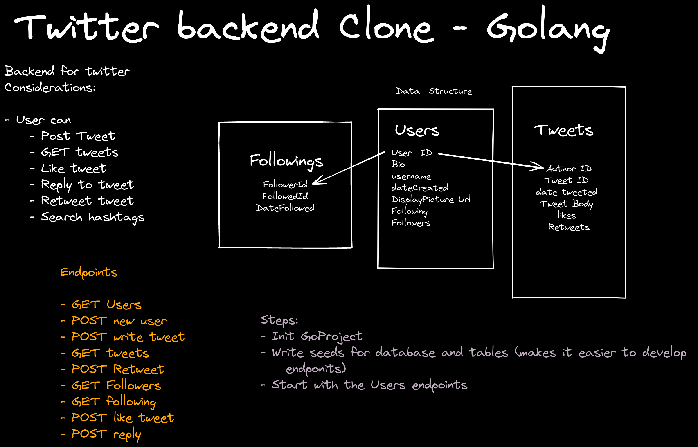

# Go Twitter backend Clone 

This repo is a (very)basic clone of Twitter's backend, set up as a REST API, providing endpoints for: 

- tweets
- users
- likes
- TODO : Retweets

## Get up and running

### prerequisites: 
- [Mysql installed and running](https://flaviocopes.com/mysql-how-to-install/)
- [Go installed](https://go.dev/doc/install)
- [Some SQL client installed](https://dev.mysql.com/downloads/workbench/)

### Steps 
- Set up the data seeds by running:
  - `seeds/setupTables.sql`
  - `seeds/users.sql`
  - `seeds/tweets.sql`
  
- run `export GO111MODULE=on`
- Run the project at the root with `go run main.go`

### Testing

- To see the API working once running locally, open `postman_collection.json` in [Postman](https://www.postman.com/), or run it in the command line using [Newman](https://learning.postman.com/docs/running-collections/using-newman-cli/command-line-integration-with-newman/)

- There are unit tests for key functions in this project (TODO Users), to run these, run `go test ./...` in the project root
